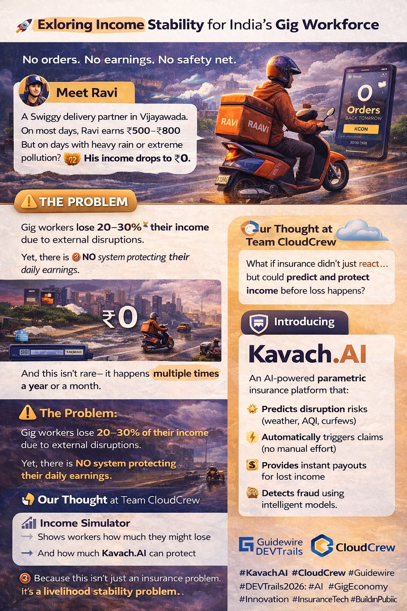

# 🚀 Kavach.AI – AI-Powered Parametric Income Protection



### 👥 Team: CloudCrew

Kavach.AI is an **AI-powered parametric insurance platform** designed to protect gig economy workers from income loss caused by external disruptions like heavy rain, pollution, and curfews.

Built as part of **Guidewire DEVTrails 2026** 🚀

---

## 🌍 Problem Statement

India’s gig workers (Swiggy, Zomato, Amazon delivery partners) rely on **daily earnings**.

However, due to:

* 🌧️ Heavy rainfall
* 🌫️ High pollution (AQI)
* 🚫 Sudden curfews

They lose **20–30% of their income**, sometimes dropping to **₹0**.

❗ Currently, there is **no system protecting their daily earnings**.

---

## 💡 Our Solution – Kavach.AI

Kavach.AI introduces **AI-powered parametric insurance**

✔️ Predicts disruptions before they happen
✔️ Automatically triggers claims
✔️ Instantly compensates income loss

👉 No paperwork. No manual claims.

---

## 🎯 Key Features

### 🧠 Predictive Risk Intelligence

* Forecasts risks using weather, AQI, and traffic data
* Alerts workers in advance

### 💰 Dynamic Weekly Premium Model

* ₹10/week → Partial income protection
* ₹25/week → Full-day income protection

**Formula:**

```id="8r0jlt"
Premium = Base Price + (Risk Score × Adjustment Factor)
```

### ⚡ Parametric Claim Automation

* Real-time monitoring
* Auto-triggered claims
* Instant payouts

### 🔍 AI-Based Fraud Detection

* Detects GPS spoofing
* Prevents fake claims
* Identifies anomalies

### 📊 Smart Dashboards

* Worker: earnings protected, alerts
* Admin: analytics, fraud insights

---

## 👤 Target Users

Food delivery partners (Swiggy / Zomato) in urban areas like **Vijayawada**

---

## ⚙️ System Workflow

1️⃣ Worker registers and selects location
2️⃣ AI generates risk profile
3️⃣ Weekly premium is calculated
4️⃣ APIs monitor real-time disruptions
5️⃣ Trigger occurs → claim auto-initiated
6️⃣ Instant payout processed

---

## 📊 Example Scenario

* AI predicts heavy rain tomorrow
* Worker receives alert
* Rain exceeds threshold
* Deliveries stop
* ✅ Claim triggered automatically
* ✅ ₹300 credited instantly

---

## 🧠 AI / ML Models

| Component            | Model            |
| -------------------- | ---------------- |
| Risk Prediction      | Random Forest    |
| Premium Optimization | Regression       |
| Fraud Detection      | Isolation Forest |

---

## 🛠 Tech Stack

**Frontend:** React.js, Tailwind CSS
**Backend:** Spring Boot (Java)
**AI Service:** Python (FastAPI / Flask)
**Database:** PostgreSQL, Redis
**APIs:** Weather API, AQI APIs
**Payments:** Razorpay (Test Mode)
**Cloud:** AWS / Render / Railway

---

## 🌟 Unique Innovations

✨ Predictive Insurance
✨ Hyperlocal Risk Pricing
✨ Zero-Touch Claims
✨ Income Loss Simulator
✨ Adaptive Coverage

---

## 🔮 Future Scope

* Platform integration (Swiggy, Zomato)
* Blockchain-based transparency
* Personalized insurance plans
* Advanced AI predictions

---

## 🏆 Built For

Guidewire DEVTrails 2026

👥 Team CloudCrew

---

## 🔗 Project Links

🎥 **YouTube Demo Video**
https://www.youtube.com/watch?v=L9tS1gLcUaM

📊 **Pitch Deck (PPT)**
[Download Kavach.AI PPT](./KavachAI.pptx)

📢 **LinkedIn Post**
https://www.linkedin.com/posts/kancharla-pujitha-sri_guidewiredevtrails2026-devtrails2026-hackathon-activity-7440404847960698880-jBpG?utm_source=share&utm_medium=member_desktop&rcm=ACoAAEl47YEByTvepf4Y8aQHVpfM03z6ofEP1eA

---
